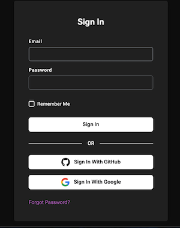
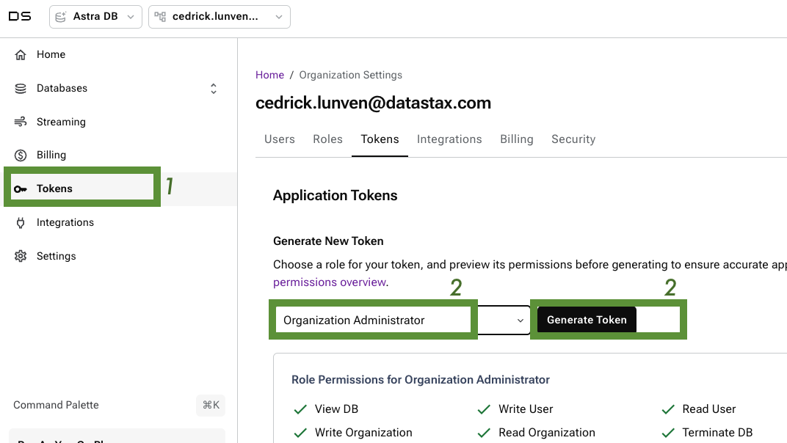

## Datastax AI stack (AWS) without a custom domain

## Table of contents

1. [Overview](#1-overview)
2. [Installation and Prerequisites](#2-installation-and-prerequisites)
3. [Setup](#3-setup)
4. [Deployment](#4-deployment)
5. [Cleanup](#5-cleanup)

## 1. Overview

### 1.1 - About this module

Terraform module which helps you quickly deploy an opinionated AI/RAG stack to your cloud provider of choice, provided by Datastax.

It offers multiple easy-to-deploy components, including:
 - Langflow
 - Astra Assistants API
 - Vector databases

### 1.2 - About this example

This example uses the AWS variant of the module, and allows you to deploy langflow/assistants easily using ECS on Fargate, using your own
custom domain.

There are a couple ways to go about this:
- The more managed way, where you provide an AWS hosted zone, and we handle the rest, or
- The less managed way, where you need to add the "default" DNS name to your own DNS, and manually provide an `acm_cert_arn` that you've
  already created

This example will follow the first way.

## 2. Installation and Prerequisites

### 2.1 - Terraform installation

You will need to install the Terraform CLI to use Terraform. Follow the steps below to install it, if you still need to.

- ✅ `2.1.a` Visit the Terraform installation page to install the Terraform CLI

https://developer.hashicorp.com/terraform/install

- ✅ `2.1.b` After the installation completes, verify that Terraform is installed correctly by checking its version:

```sh
terraform -v
```

### 2.2 - Astra token w/ sufficient perms

Additionally, you'll need a Datastax AstraDB token to enable creation and management of any vector databases.

The token must have the sufficient perms to manage DBs, as shown in the steps below.

- ✅ `2.2.a` Connect to [https://astra.datastax.com](https://astra.datastax.com)



- ✅ `2.2.b` Navigate to token and generate a token with `Organization Administrator` permissions and copy the token starting by `AstraCS:...`



Keep the token secure, as you won't be able to access it again!

### 2.3 - Authorizing with AWS

You'll need a valid pair of AWS access keys to manage your AWS infrastructure through Terraform.

Below is a short guide on how to obtain them, but you can find much more detail over at the official 
[AWS documentation](https://docs.aws.amazon.com/IAM/latest/UserGuide/id_credentials_access-keys.html).

- ✅ `2.3.a` - Access the Idenity and Access Management console (IAM) in AWS

- ✅ `2.3.b` - Create a an User with AWS and add the different permissions. 

- ✅ `2.3.c` - For this user create a pair of keys wih `access_key` and `secret_key` as follows:


- ✅ `2.3.d` - Setup the access for an application outside


Again, keep these secure!

### 2.4 - Setting up a Route53 public hosted zone

- ✅ `2.4.a` - Visit the AWS console to create a public hosted zone for your apex domain (e.g. `aws.enterprise-ai-stack.com`).

https://docs.aws.amazon.com/Route53/latest/DeveloperGuide/CreatingHostedZone.html

> Note:
>
> Make sure you create it in the same AWS account you plan to deploy the infrastructure to! Otherwise, you may run into errors
> along the lines of "Cannot find Route53 hosted zone."

This apex domain will be what you use for the `dns_name` input variable later.

## 3. Setup

### 3.1 - Cloning the sample project

- ✅ `3.1.a` - Clone the same project through the following git command:

```sh
git clone https://github.com/datastax/terraform-aws-astra-ai-stack.git
```

- ✅ `3.1.b` - Then, find your way to the correct diectory:

```sh
cd terraform-aws-astra-ai-stack/examples/aws-no-custom-domain
```

### 3.2 - Set up AWS credentials

There are quite a few valid ways to provide your credentials to the `aws` provider. You can see the 
[AWS provider docs](https://registry.terraform.io/providers/hashicorp/aws/latest/docs) for all of the valid ways to sign in.

Below is a short walkthrough on how to set up a [shared credentials file](https://docs.aws.amazon.com/cli/latest/userguide/cli-configure-files.html).
Feel free to use a different method of providing credentials, if you prefer, such as [env vars](https://registry.terraform.io/providers/hashicorp/aws/latest/docs#environment-variables).

- ✅ `3.2.a` - Create the credentials file

On Mac/Linux/WSL, this will be `$HOME/.aws/credentials`. On windows, it'll be `"%USERPROFILE%\.aws\credentials"`

- ✅ `3.2.b` - Populate the credentials file with your credentials

```ini
[my_profile] 
aws_access_key_id = ...
aws_secret_access_key = ...
region = ...
```

You can replace `my_profile` with whatever name you want—you can use `default` for it to be automatically inferred as your primary profile.

### 3.3 - Initialize Terraform

- ✅ `3.3.a` - In this specific example directory, simply run `terraform init`, and wait as it downloads all of the necessary dependencies.

```sh
terraform init
```

## 4. Deployment

### 4.1 - Actually deploying

- ✅ `4.1.a` - Run the following command to list out the components to be created. The `dns_name` will be the apex domain you created a hosted zone for earlier (e.g. `aws.enterprise-ai-stack.com`)

```sh
# If using default AWS profile
terraform plan -var="astra_token=<your_astra_token>" -var="dns_name=<dns_name>"

# If using non-default AWS profile
terraform plan -var="astra_token=<your_astra_token>" -var="dns_name=<dns_name>" -var="aws_profile=<your_profile>"
```

- ✅ `4.1.b` - Once you're ready to commit to the deployment, run the following command, and type `yes` after double-checking that it all looks okay

```sh
# If using default AWS profile
terraform apply -var="astra_token=<your_astra_token>" -var="dns_name=<dns_name>"

# If using non-default AWS profile
terraform apply -var="astra_token=<your_astra_token>" -var="dns_name=<dns_name>" -var="aws_profile=<your_profile>"
```

- ✅ `4.1.c` - Simply wait for it to finish deploying everything—it may take a hot minute!

### 4.2 - Accessing your deployments

- ✅ `4.2.a` - Run the following command to access the variables output from deploying the infrastructure

```sh
terraform output datastax-ai-stack-aws
```

- ✅ `4.2.b` - Access Langflow

In your browser, go to `langflow.<your_domain>` (e.g. `langflow.aws.enterprise-ai-stack.com`) to access Langflow.

It may initially display a 503 error—give it a second to start up.

Because this is being served over HTTP, you may need to apply [this](https://github.com/langflow-ai/langflow/issues/1508#issuecomment-2026470631) issue workaround (or the equivalent for your browser) if you just get a "error occured while fetching types" popup.

- ✅ `4.2.c` - Access Astra Assistants API

You can access the Astra Assistants API @ `assistants.<your_domain>` through your HTTP client of choice. e.g:

```sh
curl assistants.aws.enterprise-ai-stack.com/metrics
```

- ✅ `4.2.d` - Access your Astra Vector DB

You can connect to your Astra DB instance through your method of choice, using `astra_vector_dbs.<db_id>.endpoint`.

The [Data API clients](https://docs.datastax.com/en/astra-db-serverless/api-reference/overview.html) are heavily recommended for this.

## 5. Cleanup

### 5.1 - Destruction

- ✅ `5.1.a` - When you're done, you can easily tear everything down with the following command:

```sh
# If using default AWS profile
terraform destroy -var="astra_token=<your_astra_token>" -var="dns_name=<dns_name>"

# If using non-default AWS profile
terraform destroy -var="astra_token=<your_astra_token>" -var="dns_name=<dns_name>" -var="aws_profile=<your_profile>"
```
